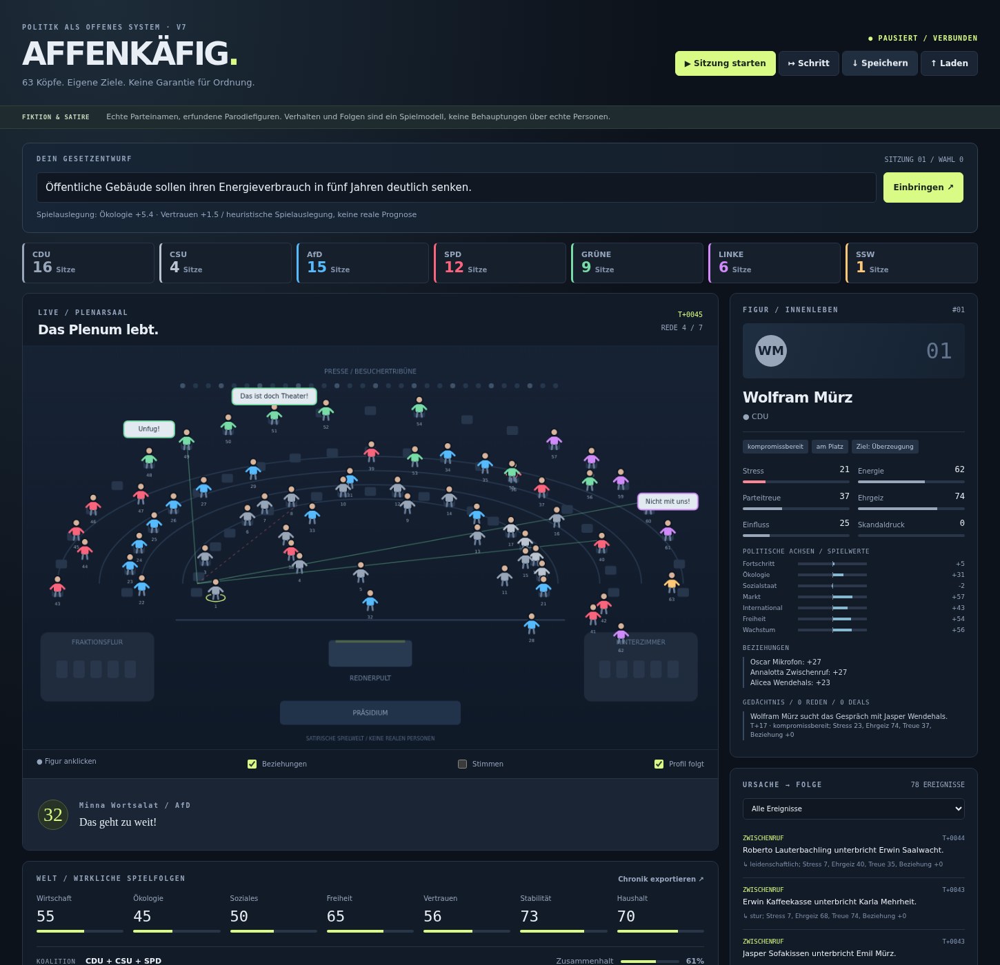
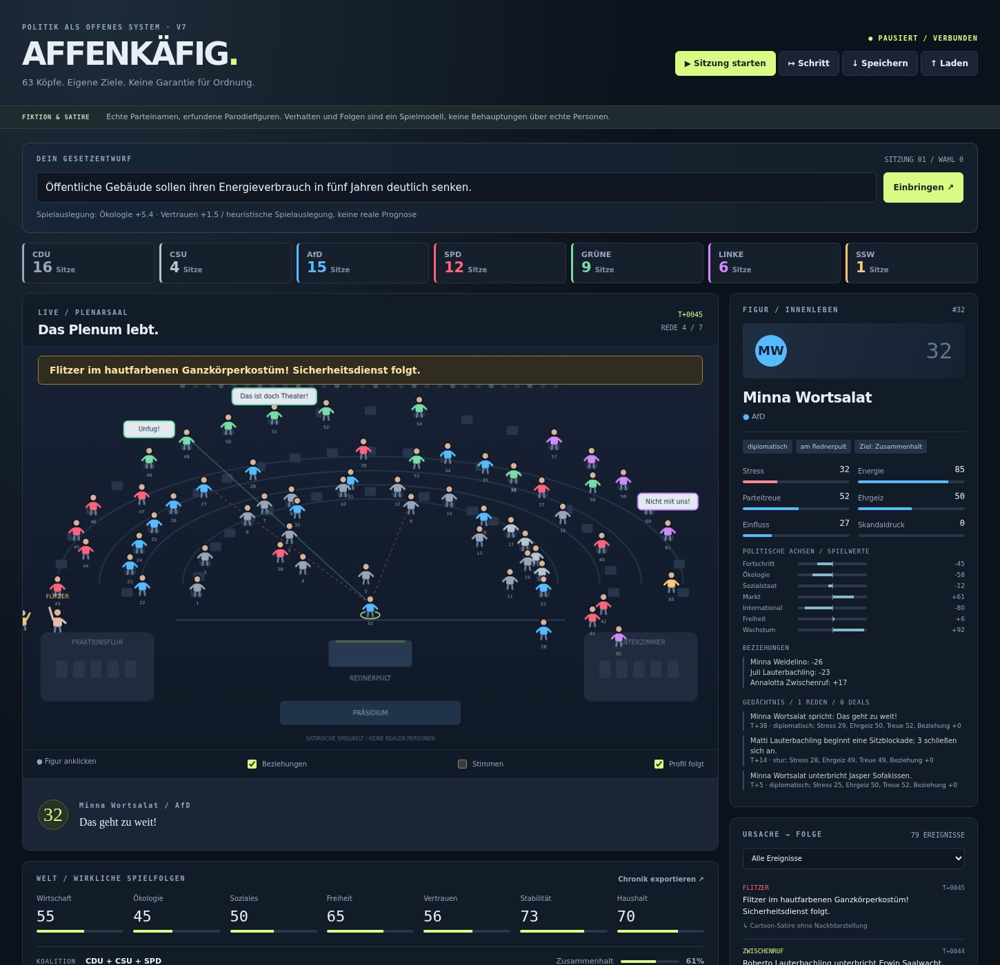

# AFFENKÄFIG

**63 minds. Their own goals. No guarantee of order.**

AFFENKÄFIG is a local, satirical parliament simulation. You watch an autonomous society of fictional politicians, submit your own bills, and see how relationships, ambition, stress, party loyalty, deals and conflicts change the room.

Version 7 rebuilds the older Tkinter prototype as a Python simulation with an animated browser interface. The simulation runs without AI. Optional **Ollama + qwen2.5:7b** adds short character dialogue, selected action proposals and interpretations of your bills without stopping the world while the model thinks.

## Screenshots



*Captured from the running application in Chrome. The initial political layout uses the 2025 election as its starting point.*



*This event was triggered manually in the optional lab to check its animation. The same event can also occur autonomously.*

## Start

Requirements: Python **3.10 or newer** and a modern browser. The game uses only Python's standard library. No pip packages are needed to play or run its unit tests.

```bash
python main.py
```

On systems where Python is called `python3`:

```bash
python3 main.py
```

The server opens **http://127.0.0.1:8766** in your browser. Click **Sitzung starten** to begin. The interface and dialogue are in German.

If the port is in use:

```bash
python main.py --port 8767
```

Other options:

```bash
python main.py --seed 75 --no-browser
```

The server binds only to your own computer. It is not a public web server or a multiplayer service.

## Optional AI

Install Ollama separately, start it, and download the model:

```bash
ollama pull qwen2.5:7b
```

Enable **Ollama / qwen2.5:7b** in the game. The default endpoint is `http://127.0.0.1:11434/api/chat`; model and endpoint can be changed in `config.py`.

Only one model request runs at a time. Requests have a 40-second timeout. The core simulation continues while the model works. Old or invalid responses are discarded; if Ollama fails, the rule model keeps running. No dialogue is spoken aloud.

The code has not yet been tested against a real Ollama server or on an RTX 2070 Super. Model speed, response quality and memory use still need to be checked on your machine.

## What the world can do

- MPs move around, speak, interrupt, talk privately, negotiate deals and form relationships.
- Stress, anger, energy, ambition, influence, loyalty and scandals affect their choices.
- Deals can be exposed. Arguments can escalate into cartoon brawls, followed by security intervention and temporary exclusion from votes.
- Sit-ins, walkouts, resignations, party switches and splinter groups change attendance and power.
- The coalition can lose its majority or break down. A crisis can trigger an election and a new fictional seat distribution.
- The presidium can clear the chamber. MPs return after a cooling-off period.
- Streakers wear a skin-colored full-body costume; there is no nude depiction. At higher absurdity, a goose, confetti, blackouts and a coffee crisis can interrupt proceedings.
- Every figure has recent memories. The feed records both events and the state or relationship behind them.

The default **absurdity is 75/100**. Absurdity and conflict pressure are separate controls: higher absurdity adds more silly disruptions; higher conflict pressure makes existing tensions more likely to escalate. Optional lab buttons let you trigger events deliberately, but they are not needed for normal play.

## Bills have game effects

A session contains seven speeches, an amendment vote and a final vote. Each MP votes from personal political values, party alignment, loyalty and persuasion. Absent MPs do not vote; the game checks attendance before accepting a bill.

Passed bills change defined world values: economy, ecology, welfare, freedom, public trust, stability and budget. The amendment changes the size of those effects. Bills explicitly dissolving a named party can move its figures into the unaffiliated group and change the balance of power.

Without Ollama, bill interpretation uses visible keyword rules. With Ollama, a checked JSON interpretation can replace those rules before the voting phase. Effects are limited to the supported world values and party-dissolution operation. The interpretation is shown below the bill so you can see what the game understood.

**"Anything can happen" is a design direction, not a literal promise.** This is an open combination of supported actions and consequences, not a program that can execute every imaginable law or generate arbitrary new mechanics. A strange bill may receive only a partial or neutral interpretation. This is not a legal or economic simulator: a real Bundestag cannot simply dissolve a party by ordinary vote, and the election/coalition rules here are simplified game rules.

## Political starting point

Real party names are used. Every politician is a fictional parody with a randomly combined name; there is no one-to-one model of any real MP.

The starting seats are a reduced version of the **final 2025 Bundestag election result**, with an explicit adjustment to keep the SSW represented in a 63-person world:

| Party | Official 2025 seats | Game seats |
| --- | ---: | ---: |
| CDU | 164 | 16 |
| CSU | 44 | 4 |
| AfD | 152 | 15 |
| SPD | 120 | 12 |
| Bündnis 90/Die Grünen | 85 | 9 |
| Die Linke | 64 | 6 |
| SSW | 1 | 1 |
| **Total** | **630** | **63** |

Pure proportional rounding would give CDU 17 and SSW 0. Here one CDU game seat is reassigned to the SSW so all represented parties remain visible. The starting game coalition is CDU + CSU + SPD. Later elections are fictional and do not reproduce actual German electoral law.

Political axes are hand-tuned, subjective abstractions guided by published 2025 program summaries. They are not measured scores, factual ratings of parties or predictions of party behavior. Personality, violence, deals, scandals and other generated actions are fictional satire and must not be read as allegations about real parties or people.

Sources for the factual starting point and broad policy themes:

- [Federal Returning Officer: final Bundestag election result, 14 March 2025](https://www.bundeswahlleiterin.de/info/presse/mitteilungen/bundestagswahl-2025/29_25_endgueltiges-ergebnis.html)
- [Deutsche Welle: party programs for the 2025 election](https://www.dw.com/de/bundestagswahl-2025-die-parteiprogramme/a-71592905)
- [SSW: core demands for the 2025 election](https://www.ssw.de/fileadmin/user_upload/daten/SSW_Kernforderungen_BTW_2025-net.pdf)

## Saving your world

Use **Speichern** to download a JSON save. Use **Laden** to restore it; loaded games start paused. Saves include the world, relationships, recent memories, the random generator state and the retained event history. Keep the downloaded file somewhere safe before closing the server. There is no automatic disk save.

**Chronik exportieren** downloads the retained event feed and passed laws. The feed keeps the latest 600 events; each figure remembers its latest 16 relevant events. Export periodically if you want a longer record. Version 7 does not import old v6 world states.

A seed reproduces the rule model when the same sequence of inputs is used. Optional model responses are not deterministic, and timing can change which proposal is accepted.

## Tests and limits

Run the automated suite:

```bash
python -m unittest test_engine -v
```

The current suite contains **65 passing tests**, including multi-seed long runs, saves and deterministic continuation, voting attendance, bill effects, party dissolution, elections, evacuations, action validation, and HTTP origin/token checks.

The interface was checked in real Chrome on Linux, at desktop and narrow mobile widths, with no JavaScript errors in the tested flow and no horizontal overflow on mobile. Screenshots were visually inspected. No browser automation packages are required by the game itself.

Still untested: Windows, other browsers, real Ollama output, GPU performance, and long-session balance with a human watching. There is no sound, multiplayer or cloud save. The optional lab makes particular events easy to inspect; the frequency and balance of autonomous rare events will need playtesting.

## Files

- `main.py`: start the application.
- `server.py`: local HTTP server, controls and independent simulation/model workers.
- `engine.py`: agents, events, laws, votes, elections and saves.
- `config.py`: parties, initial seats, political game values and model configuration.
- `ollama_client.py`: bounded JSON model requests and profile validation.
- `index.html`, `style.css`, `game.js`: browser interface and animated chamber.
- `test_engine.py`: standard-library test suite.
- `legacy_v6.py`: the original older prototype, preserved separately. Start v7 with `main.py`, not this file.

This project is political satire. It is not affiliated with the Bundestag or any party.
